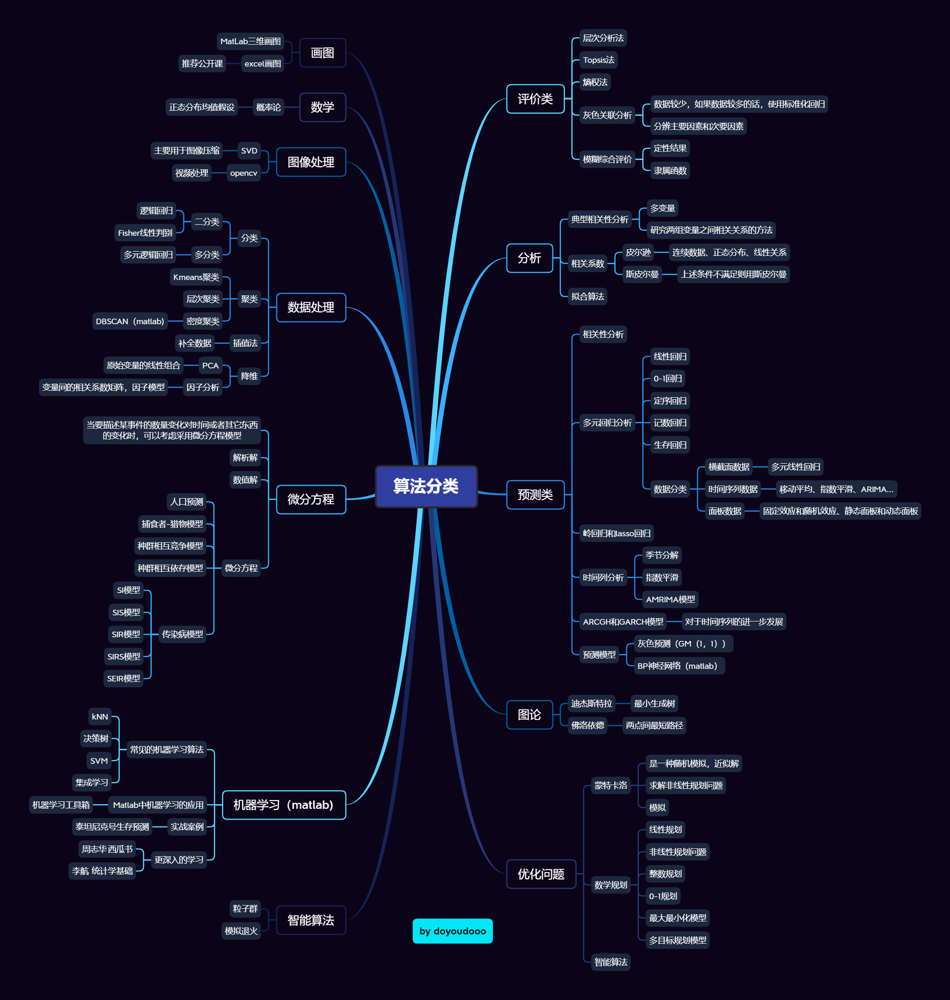

# 数学建模国赛总结

本人系2021年国赛C题国二得主（21年参赛队伍总数49529+，总共14万人），主要负责辅助编程，数据处理、建模写作。

距离21年国赛结束已有半年时间，现在大三下有些空余时间，因此写下该分享贴（菜鸟一枚），对国赛C题感兴趣的同学可以适当一看，获奖具有偶然性，天时地利人和最重要。

团队背景：

1.专业背景：三人均为普通本科生大三学生，专业均为计算机类相关。

2.知识背景：三人均具备数模基本知识，计算机编程知识。本人主要学习了统计建模、数据挖掘、matlab和python编程（还是一个菜鸟）

### 本人比赛经历

- 2021.6 校赛二等奖 
- 2021.8 真题训练 https
- 2021.9 全国大学生数学建模国赛C题 国家二等奖 htt
- 2022.2 美赛 

### 国赛回顾

2021年的C题

   在开始展示比赛之前我们训练了很多次，做了大概近五年的题目，但是当时可能仅仅只专注各自题目的模型，没有一个整体上的的统一思想，方法论还不是那么熟练，导致每次训练都很感觉只是学到了模型，没有太过关注于出题者本身的思想，之后的美赛我们训练的时候总结出了很好的一套训练流程，时间利用率大大提升。ps：在美赛训练时获得最大的思想其实是从一篇博客上看到的：用通俗易懂的方法建立具有可解释性的决策模型，并通过优美的图表展示出来，对于题目的每一个需要解决的问题都给出了简洁明了且可行的决策方法和分析，每个模型都在通俗易懂和高逼格之间达到了一定平衡。

回到本次比赛：

首先第一问是要找到402家供应商中最重要的50家，第二问是最少要选择多少家供应商才能满足需求，并且提供未来二十四周的供应计划。第三问是要尽量采购A和C类原材料并希望损耗最小，第四问是根据现有原材料的供应商和转运商的实际情况，确定该企业每周的产能可以提高多少，并给出未来 24 周的订购和转运方案。

其实题目的难度主要是集中第二问，从第一问的一个简单的特征指标提取及评价模型，到第二问三个小模型，我们分别使用了0-1规划、单目标规划（模拟退火）、非线性规划模型，到第三问的多目标粒子群算法，第四问的单目标规划，前3问我们的答案都和官方的答案差不多，当时第四问误差有点大，从而错失了推荐国一的机会，ps猜测是单目标规划的约束条件没有考虑好。

整体来说2021年C题难度适中，但更注重模型掌握的熟练程度，选择合适的模型远比复杂的方法更为关键，所以基础尤为关键。

### 美赛回顾

准备中

### 备赛建议

#### 本人的数模学习历程

- 大二上学期：通过学长知道了这个比赛，同时又遇到了两个志同道合的同学，所以从大二下的寒假开始准备参加比赛
- 寒假期间：三个人都预习了概率论、线性代数、同时也在看一个up主清风的数模视频，学习了一些算法
- 大二下学期：继续寒假未看完的教程并且每次做完课后作业，在这期间并没有打很多比赛，主要每次我们学完了一个算法都会按照国赛的标准写一篇完整的小论文，相当于一次锻炼了，更有助于对算法的理解，在这期间通过学校的选拔，获得校一成绩，而其实只是我一个人三四天就成的结果，因为训练的次数多了，就熟练了，当然校赛简单也是一方面
- 大二暑假：在暑假期间我们结束了整个数模学习过程，开始按照国赛时间进行了六次训练，这期间也是学到了好多新的知识，既有新的建模方法，也有写作技巧。
- 大三上的寒假:参加数学建模美赛

以下是我整个数模期间学习的算法和一些技巧：

在这些算法中主要熟练掌握了数据分析类算法，对于微分方程类题目只是学习了解的程度，并没有很精通，所以我们国赛和美赛都选择的C题,在学习建模的时候最好之前就确定好自己想要学习的重点，这样有针对性的学习效率更高！

### 软件推荐

要想做好一份建模比赛离不开一些好的软件，下面我推荐一下我个人使用的软件

- 编程： MATLAB、 STata、SPSS、VS 2019、mysql、Pycharm、IDEA、Notepad++、Vmware、anaconda、CUDA
- 网络工具：Xshell、Xftp、ffmpeg、谷歌浏览器
- 绘图：excel、PPT、visio、Xmind、EdrawMax（亿图图示）、
- 写作word、wps、typora+picgo、git、Pandoc
- 公式相关：Axmath
- PDF相关：ABBYY（最强PDF OCR识别工具、pdf转word和excel）
- Excel相关：excel2latex、XL toolbox、方方格子
- 图像处理：画图、inpaint、PS
- 压缩解压：7-zip、bandzip、
- 翻译工具：有道词典、DeepL pro、腾讯翻译君
- 下载工具：IDM、迅雷、
- 搜索工具: everything、utool、
- 数据恢复：R-Studio
- 其他必备软件：上网工具、IDM（高速下载工具）、天若OCR（截图OCR识别工具）

最后推荐一下我的学习过程

首先高等数学、概率论、线性代数可以直接搜考研课程直接过一遍，构建起最基本的数学基础，接下里是编程软件的学习，有三种选择，一种是python，适合计算机专业的学生，衔接起来毫无压力，拥有大量的数据分析的库；第二个是matlab，适合工科如机械等专业，其应用范围也很广；最后一种是R，适合统计学专业的学生，其在统计学上应用也很广。

数学建模书籍的话推荐《数学模型》姜启源/谢金星和《数学建模算法与应用》司守奎，视频推荐清风建模视频

